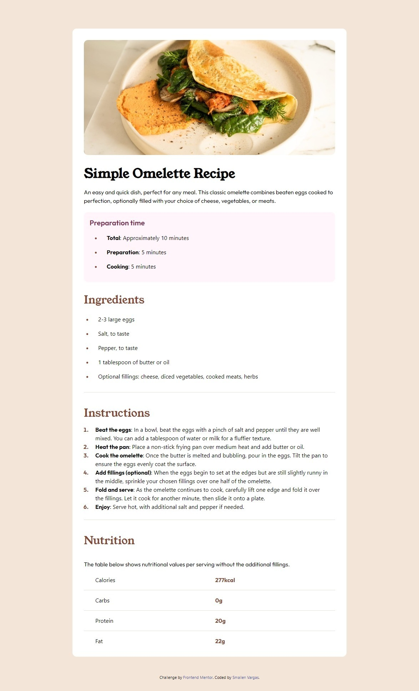

# Frontend Mentor - Recipe page solution

This is a solution to the [Recipe page challenge on Frontend Mentor](https://www.frontendmentor.io/challenges/recipe-page-KiTsR8QQKm). Frontend Mentor challenges help you improve your coding skills by building realistic projects. 

## Table of contents

- [Overview](#overview)
  - [Screenshot](#screenshot)
  - [Links](#links)
- [My process](#my-process)
  - [Built with](#built-with)
  - [What I learned](#what-i-learned)
  - [Useful resources](#useful-resources)
- [Author](#author)


## Overview

### Screenshot




### Links

- Solution URL: [solution](https://github.com/Smailen5/recipe-page-main)
- Live Site URL: [live site](https://smailen5.github.io/recipe-page-main/)

## My process

### Built with

- Semantic HTML5 markup
- CSS custom properties
- Flexbox
- CSS Grid
- Mobile-first workflow
- Tailwind CSS


### What I learned

Ho imparato molto da questo progetto dall'importare i fonts in Tailwind ad utilizzare flex-box in combinazione con grid

Ho utilizzato per la prima volta grid
```html
<p class="flex justify-around md:grid md:grid-cols-2 md:ml-8">
  Calories
  <span class="text-Nutmeg font-outfit font-bold md:grid md:grid-cols-1">277kcal</span>
</p>
```
Ho imparato a modificare uno stile di default su Tailwind
```css
@layer base {
  li.py-2::marker,
  li::marker {
    color: hsl(14, 45%, 36%);
  }
  li::marker {
    font-weight: 700;
    font-family: 'outfit', sans-serif;
  }
}
```


### Useful resources

- [Tailwind custom fonts](https://www.youtube.com/watch?v=arfDRUIZOiw&ab_channel=NetNinja) - Questo video e stato utile per capire come importare i font di google con tailwind.


## Author

- Website - [Smailen5](https://github.com/Smailen5)
- Frontend Mentor - [@Smailen5](https://www.frontendmentor.io/profile/Smailen5)
- Linkedin - [@smailen-vargas](https://www.linkedin.com/in/smailen-vargas/)